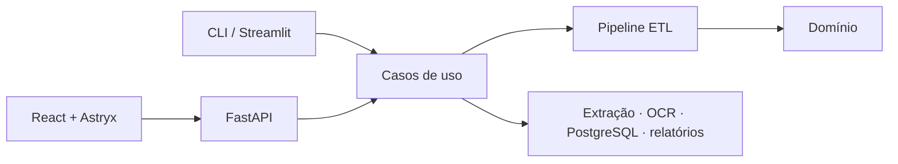

# Waypoint

> **ERP & CRM Data Migration Toolkit** — Extract. Map. Validate. Migrate.

[](https://github.com/Sheiden1/waypoint-etl/actions/workflows/ci.yml)
[](https://www.python.org/)
[](LICENSE)
[](https://github.com/Sheiden1/waypoint-etl/releases/tag/v0.2.0)

Toolkit **open-source** que prepara dados legados de ERP e CRM para importação:
extrai de planilhas e documentos, aplica um mapeamento De/Para configurável,
normaliza dados brasileiros, valida, identifica duplicidades e gera relatórios
auditáveis.

Projeto pessoal e **educacional**. Não é uma plataforma pronta para tratar dados
reais em produção — o uso com dados reais exige avaliação própria de segurança,
infraestrutura e LGPD. Projeto independente, sem vínculo com a HashiCorp ou
qualquer outra organização que use o nome *Waypoint*.

## Experimente

**[▶ Abrir a demonstração](https://waypoint-etl.vercel.app)**

Envie um CSV, monte o De/Para e baixe os relatórios, sem instalar nada.

> A demonstração roda em planos gratuitos, sem autenticação e sem banco
> configurado: a carga no PostgreSQL aparece como indisponível e o restante do
> fluxo funciona. **Não envie dados pessoais reais.** A API hiberna após 15
> minutos sem tráfego, então a primeira chamada pode levar cerca de um minuto.


[Assista à demonstração curta](docs/demo/waypoint-demo.mp4)

## O problema

Quem troca de ERP ou CRM recebe dados legados em formatos incompatíveis:
planilhas com cabeçalhos diferentes, datas e valores em formatos inconsistentes,
CPFs e CNPJs com ou sem máscara, clientes duplicados, PDFs e documentos
escaneados. Conferir isso à mão é lento e deixa passar erro.

O Waypoint automatiza o fluxo:

**extrair → mapear → limpar → normalizar → validar → deduplicar → revisar →
carregar → auditar.**

Nada é gravado sem `dry-run` antes, e toda execução é rastreável por um `run_id`.

## Recursos

- **Origens:** CSV, Excel, TXT, DOCX, PDF digital, PDF escaneado e imagens;
- **Documentos viram registros** por reconhecimento de pares `Rótulo: valor`;
- **OCR local** com Tesseract, acionado só quando o texto nativo é insuficiente;
- **De/Para declarativo** em YAML, versionável, ou montado visualmente;
- **Dados brasileiros:** CPF/CNPJ com dígitos verificadores, datas, moeda em
  `Decimal`, telefone, CEP e UF;
- **Duplicidades** exatas e aproximadas — sinalizadas, nunca mescladas sozinhas;
- **Três interfaces sobre o mesmo núcleo:** web, CLI e Streamlit;
- **Auditoria:** quatro artefatos por execução e carga transacional opcional.

## Instalação

**Docker** é o caminho mais curto para rodar tudo, incluindo PostgreSQL e OCR:

```bash
git clone https://github.com/Sheiden1/waypoint-etl.git
cd waypoint-etl
docker compose up --build
```

O Compose sobe o banco, aplica as migrações e inicia a interface com Tesseract e
o idioma português já instalados.

**Como biblioteca ou CLI**, a partir do wheel publicado na
[release mais recente](https://github.com/Sheiden1/waypoint-etl/releases/latest):

```bash
pip install waypoint_etl-0.2.0-py3-none-any.whl
```

Ou direto do repositório:

```bash
pip install git+https://github.com/Sheiden1/waypoint-etl.git
```

Requer Python 3.12 ou superior. O pacote ainda não é distribuído pelo PyPI. Os
templates De/Para vivem em `mappings/`, no repositório, e não são embutidos no
wheel — aponte `MAPPINGS_DIR` se instalar o pacote isoladamente.

Para montar o ambiente de desenvolvimento, veja o
[guia de contribuição](CONTRIBUTING.md).

## Uso pela CLI

Inspecionar uma origem antes de migrar:

```bash
waypoint-etl inspect samples/input/clientes_legado.xlsx --sheet Clientes --header-row 2
```

Executar em `dry-run`, que é o padrão e nunca grava no banco:

```bash
waypoint-etl migrate \
  --input samples/input/clientes_legado.xlsx \
  --mapping mappings/erp_legacy_customers.yaml \
  --output ./exports
```

Cada execução gera `exports/<run_id>/` com quatro artefatos:

| Arquivo             | Conteúdo                                          |
| ------------------- | ------------------------------------------------- |
| `accepted.csv`      | registros válidos, no schema canônico             |
| `rejected.xlsx`     | uma linha por problema, com os valores de origem  |
| `duplicates.csv`    | duplicatas exatas e suspeitas                     |
| `audit-report.json` | metadados, totais, duração por estágio e alertas  |

O comando sai com código `1` quando há rejeitados, o que permite usá-lo em
verificação automatizada. Para efetivar a carga:

```bash
waypoint-etl migrate ... --no-dry-run --load-postgres
```

## Mapeamento De/Para

O vínculo entre a origem e o schema canônico é declarado em YAML e versionado
em `mappings/`:

```yaml
fields:
  CPF_CNPJ:
    target: document
    required: true
    transforms:
      - digits_only
```

As transformações vêm de um **catálogo fechado**: um template escolhe entre
funções conhecidas e auditáveis, nunca executa código arbitrário. Um nome
inexistente faz o carregamento falhar listando as opções válidas.

O bloco `source` diz como ler a origem. Para documentos, que não têm colunas,
ele declara como encontrar registros no texto — e cada rótulo passa a funcionar
como o nome de uma coluna:

```yaml
source:
  type: txt
  record_mode: separator      # ou "page": uma ficha por página
  record_separator: '^-{10,}$'
  label_separator: ':'        # o extrator DOCX usa '|'
```

Linhas sem rótulo são ignoradas, então cabeçalhos e molduras de relatório não
viram campo. Texto vindo de OCR entra com aviso explícito: reconhecimento óptico
nunca é tratado como confiável.

O repositório traz templates para clientes (Excel, CSV, TXT e DOCX), contatos e
cobranças. Veja o [guia completo de mapeamento](docs/mapping-guide.md).

## Arquitetura



Monólito modular em camadas. O domínio não depende de interface, banco ou OCR;
CLI, Streamlit e FastAPI apenas montam parâmetros e apresentam os mesmos objetos
de resultado — nenhuma rota HTTP duplica regra do pipeline.

Detalhes em [docs/architecture.md](docs/architecture.md), e o histórico da
jornada web em [docs/web-platform-roadmap.md](docs/web-platform-roadmap.md).

## Dependências externas opcionais

Nenhuma delas impede o projeto de rodar — cada ausência apenas limita o que está
disponível, sempre com mensagem explícita:

| Recurso        | Sem ele                                                          |
| -------------- | ---------------------------------------------------------------- |
| **PostgreSQL** | só o modo `dry-run`; exportações continuam funcionando            |
| **Tesseract**  | PDFs escaneados e imagens não são lidos; os demais formatos, sim  |

Para o OCR, o pacote de idioma português (`por`) é recomendado; sem ele o
Waypoint cai para o inglês em vez de falhar. No CI, ambos rodam de verdade.

## Dados de demonstração

`python -m waypoint_etl.demo` gera em `samples/input/` um conjunto sintético com
clientes, contatos e cobranças em todos os formatos suportados, incluindo um PDF
sem camada de texto e uma imagem para exercitar o OCR.

Todos os registros são gerados com semente fixa: **nenhum dado pessoal real é
usado ou versionado.** Os arquivos binários não vão para o Git — gere-os depois
de clonar.

## Limitações

- documentos viram registros por pares `Rótulo: valor`; texto corrido sem
  rótulos e tabelas dentro de PDF ainda não são estruturados;
- valores lidos por OCR entram com aviso e exigem conferência;
- escrita manual não é suportada;
- não há autenticação, multitenancy, filas ou integração com ERPs comerciais;
- possíveis duplicidades são sinalizadas, nunca mescladas automaticamente;
- documentos enviados não têm armazenamento permanente;
- uso com dados reais exige avaliação própria de segurança e LGPD.

## Contribuindo

Contribuições são bem-vindas. Comece pelo [guia de contribuição](CONTRIBUTING.md),
que cobre ambiente, fluxo de trabalho e verificações, e pelo
[Código de Conduta](CODE_OF_CONDUCT.md).

Bugs e melhorias podem ser abertos pelos templates de issue. Vulnerabilidades
devem usar o relato privado descrito na [Política de Segurança](SECURITY.md).

Para publicar sua própria instância em serviços gratuitos, veja o
[guia de deploy](docs/deployment.md).

## Licença

Distribuído sob a licença [MIT](LICENSE).

---

## English summary

**Waypoint** is an open-source, educational toolkit that simulates a realistic
data migration between legacy ERP and CRM systems. It extracts data from
spreadsheets and documents — including scanned files via local OCR — applies a
configurable field mapping, cleans and normalizes Brazilian data (dates,
currency, CPF/CNPJ, phones, postal codes), validates records, flags duplicates,
and produces auditable migration reports. A `dry-run` mode guarantees nothing is
written to the database until you confirm.

Try the [live demo](https://waypoint-etl.vercel.app) — but please **do not
upload real personal data**: it runs on free tiers without authentication.

This is a portfolio/demo project, **not** a production-ready data platform. It
is independent and **not** affiliated with HashiCorp or any other organization
using the *Waypoint* name. Contributions are welcome — see
[CONTRIBUTING.md](CONTRIBUTING.md).
