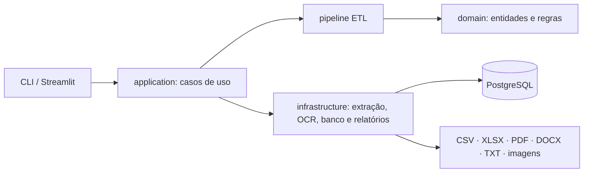
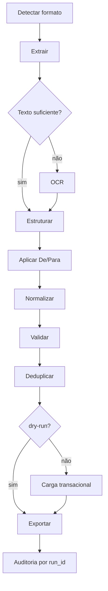

# Arquitetura

O Waypoint usa um monólito modular em camadas. CLI e Streamlit são adaptadores
de apresentação: ambos chamam os mesmos casos de uso.

## Responsabilidades

| Camada | Responsabilidade | Não deve conhecer |
| --- | --- | --- |
| `domain` | entidades, enums, value objects e contratos canônicos | Streamlit, SQLAlchemy, Pandas, OCR |
| `application` | DTOs, portas e orquestração de casos de uso | detalhes da interface |
| `pipeline` | mapear, limpar, validar e deduplicar | banco e componentes visuais |
| `infrastructure` | extratores, OCR, PostgreSQL e relatórios | decisões de navegação da interface |
| `presentation` | parâmetros, upload e apresentação de resultados | regras duplicadas do pipeline |

## Fluxo de uma migração

Cada linha inválida é isolada e não interrompe o lote. Um erro de infraestrutura
na carga reverte a transação inteira. O `dry-run` é bloqueado antes de qualquer
conexão de escrita.

## Persistência

As tabelas de destino são `customers`, `contacts` e `invoices`. Auditoria usa
`migration_runs` e `migration_issues`. Alembic mantém o schema e lê
`DATABASE_URL` apenas do ambiente.

## Decisões do MVP

- um processo e um banco; sem filas ou microsserviços;
- templates versionáveis em vez de código arbitrário;
- aproximações geram alertas, nunca merge automático;
- documentos enviados não têm armazenamento permanente;
- OCR é um fallback explícito, sempre seguido de validação.
