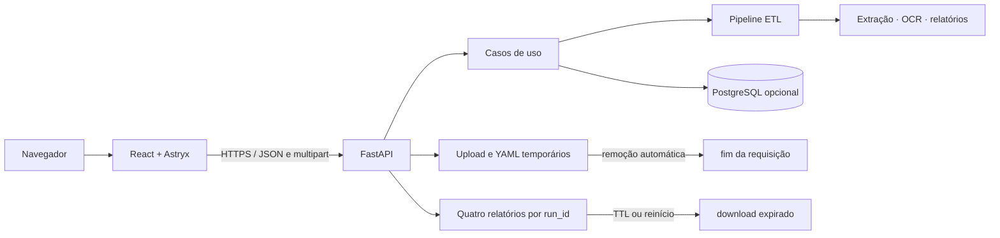

# Plataforma web do Waypoint

> Arquitetura e roadmap da jornada iniciada após a `v0.1.0`.

**Estado atual:** as Fases 1–5 estão funcionais e a Fase 6 está concluída. A
interface está publicada no Vercel Hobby e a API no Render Free, com o smoke
test remoto aprovado nas sete checagens.

| Serviço | URL pública |
| --- | --- |
| Interface | <https://waypoint-etl.vercel.app> |
| API | <https://waypoint-etl-api.onrender.com> |

## Visão

A plataforma web do Waypoint é uma interface open-source para explorar, preparar
e migrar dados legados. Ela não é um SaaS, não possui cobrança e não depende de
conta de usuário. A experiência deve ser útil por padrão e personalizável sem
obrigar quem contribui a conhecer todo o pipeline Python.

Princípios:

- **funcional antes de decorativo:** todo controle visível executa uma ação real;
- **arquivos efêmeros:** uploads são removidos ao fim de cada operação e os
  relatórios ficam disponíveis somente durante um TTL;
- **mesmo núcleo:** CLI, Streamlit e API usam os mesmos casos de uso;
- **local e hospedável:** a aplicação funciona localmente e em serviços gratuitos;
- **personalizável:** aparência e preferências ficam separadas das regras do ETL;
- **progressivo:** o Streamlit permanece disponível até a nova interface cobrir o
  fluxo completo;
- **sem estética genérica:** Astryx fornece a base, mas o tema e as composições
  pertencem ao Waypoint.

## Decisões técnicas

| Área | Escolha | Motivo |
| --- | --- | --- |
| Interface | React 19 + Vite + TypeScript | SPA simples, rápida e adequada ao Vercel |
| Design system | Astryx `core` | componentes acessíveis, tipados e tematizáveis |
| Tema | `waypointTheme`, derivado do Neutral | preserva os tokens e estados do projeto |
| API | FastAPI no pacote Python atual | borda HTTP fina sobre os casos de uso |
| Contrato | OpenAPI + modelos Pydantic | documentação e tipagem verificáveis |
| Persistência | PostgreSQL opcional | mantém o comportamento atual e o `dry-run` |
| Estado do fluxo | React local, sem estado global no início | reduz complexidade |
| Arquivos | upload por requisição e relatórios temporários por `run_id` | evita retenção acidental sem impedir downloads |
| Deploy gratuito | Vercel + Render + Neon | separa interface estática do processamento |

O Astryx está em beta. As versões devem permanecer fixadas no lockfile. Nesta
jornada serão usados apenas pacotes publicados e estáveis (`core`, tema Neutral
e CLI); componentes `lab` e gráficos em canal canary ficam fora do escopo.

### Limites do deploy gratuito

Esta combinação é adequada ao caráter pessoal e não comercial do Waypoint, mas
não equivale a infraestrutura de produção:

- **Vercel Hobby:** hospeda o frontend estático, sem cobrança por excedente; ao
  atingir a cota, o recurso aguarda a renovação do período;
- **Render Free:** hospeda a API, entra em repouso após 15 minutos sem tráfego e
  pode levar cerca de um minuto para responder à primeira chamada;
- **Neon Free:** permanece opcional, com suspensão automática de compute e
  armazenamento limitado; o fluxo `dry-run` não precisa dele;
- **arquivos efêmeros:** o disco temporário do Render combina com o modelo do
  Waypoint, porque cada upload é apagado após a operação e não serve como
  armazenamento permanente;
- **custo zero intencional:** não adicionar forma de pagamento nem promover
  instâncias; quando uma cota terminar, aceitar suspensão até sua renovação.

As cotas e os termos podem mudar. Antes de cada publicação, revisar a
[documentação do Vercel Hobby](https://vercel.com/docs/plans/hobby), os
[limites gratuitos do Render](https://render.com/docs/free) e o
[plano gratuito do Neon](https://neon.com/pricing).

## Arquitetura



A API não contém regras de transformação ou validação. Ela limita e materializa
o upload, chama `application` e serializa o resultado. O frontend não tenta
replicar detecção de formato: valida somente tamanho e extensão para antecipar
erros simples, enquanto o backend continua sendo a fonte da verdade.

### Fronteiras

```text
web/
├── src/app/          # composição, providers e navegação
├── src/features/     # upload, inspeção, mapeamento, validação e resultado
├── src/lib/          # cliente HTTP e utilidades sem interface
├── src/theme/        # tema Waypoint e preferências visuais
└── src/styles/       # estilos globais e composições da aplicação

src/waypoint_etl/presentation/
├── api/              # rotas HTTP, schemas e tratamento de erros
├── streamlit/        # interface legada durante a transição
└── uploads.py        # adaptador comum para uploads efêmeros
```

## Design e personalização

O tema Waypoint estende o Neutral do Astryx e mantém os estados semânticos:

| Token Waypoint | Escuro | Uso |
| --- | --- | --- |
| fundo | `#0D1117` | canvas principal |
| superfície | `#161B22` | painéis e conteúdo elevado |
| borda | `#30363D` | separação estrutural |
| ação | `#58A6FF` | CTA, seleção e foco |
| sucesso | `#3FB950` | registros válidos |
| atenção | `#D29922` | duplicidades e avisos |
| erro | `#FF7B72` | rejeições e falhas |
| texto | `#C9D1D9` | conteúdo principal |
| texto secundário | `#8B949E` | metadados e ajuda |

As preferências de modo claro/escuro/sistema, densidade e redução de movimento
são armazenadas no próprio navegador. Temas comunitários podem ser adicionados
como módulos TypeScript que implementam o contrato em
`web/src/theme/communityThemes.ts`, sem alterar componentes ou regras do fluxo.

Regras visuais:

- raios discretos e hierarquia baseada em seções, não em uma parede de cards;
- cor nunca é o único indicador de estado;
- tabelas e conteúdo técnico priorizam leitura e rastreabilidade;
- animações comunicam mudança de estado e respeitam movimento reduzido;
- ilustrações são opcionais; a ferramenta não depende delas para funcionar.

## API inicial

| Método | Rota | Responsabilidade |
| --- | --- | --- |
| `GET` | `/api/v1/health` | saúde e recursos disponíveis |
| `POST` | `/api/v1/inspect` | upload efêmero e prévia da origem |
| `GET` | `/api/v1/mappings` | catálogo de templates |
| `POST` | `/api/v1/mappings/preview` | validar ou montar o De/Para |
| `POST` | `/api/v1/migrations/dry-run` | executar validação completa |
| `GET` | `/api/v1/migrations/{run_id}/artifacts/{artifact_name}` | baixar artefato |
| `POST` | `/api/v1/migrations/load-postgres` | reprocessar origem e YAML e carregar no PostgreSQL |

Todas as rotas da tabela estão implementadas. `dry-run` e `load-postgres`
recebem `file`, `mapping` e `entity` como `multipart/form-data`. A carga exige
também `confirm=true`: sem isso retorna `409 confirmation_required`; sem banco
configurado retorna `503 database_unavailable`. Ela não reutiliza um `run_id`
anterior, pois reprocessa a origem no modo transacional e retorna o resultado
completo acrescido de `loaded_records`.

As respostas de validação e carga incluem `artifacts`,
`artifacts_expires_in_seconds` e os links dos quatro nomes permitidos:
`accepted.csv`, `rejected.xlsx`, `duplicates.csv` e `audit-report.json`. O
upload original e o YAML são apagados no fim da requisição. Somente esses
relatórios são copiados para o armazenamento temporário da API, com TTL
configurado por `ARTIFACT_TTL_SECONDS` (1.800 segundos por padrão); expiração ou
reinício da instância invalida os links.

## Roadmap

### Fase 1 — Fundação e inspeção ✅

- [x] registrar arquitetura e decisões;
- [x] criar o app React/Vite;
- [x] integrar Astryx e o tema Waypoint;
- [x] criar FastAPI com healthcheck;
- [x] inspecionar CSV, Excel e documentos por upload;
- [x] apresentar colunas, linhas, texto, avisos e uso de OCR;
- [x] testar contratos Python e estados principais do frontend.

**Aceite:** `clientes_legado.csv` pode ser enviado na nova interface e retorna
uma prévia real gerada pelo caso de uso `inspect_source`.

### Fase 2 — Mapeamento ✅

- [x] catálogo de templates versionados;
- [x] upload e validação de YAML;
- [x] associação visual origem → destino;
- [x] sugestão determinística por nomes conhecidos;
- [x] validação e download do template criado.

**Aceite:** um usuário conclui um De/Para válido sem editar YAML manualmente.

### Fase 3 — Dry-run e qualidade ✅

- [x] execução rastreável por `run_id`;
- [x] resumo de válidos, rejeitados e duplicidades;
- [x] tabela de problemas com filtros;
- [x] transformações aplicadas e duração por estágio;
- [x] estados claros de processamento, falha e nova tentativa.

**Aceite:** o cenário sintético preserva os totais de regressão publicados.

O endpoint recebe origem e YAML como multipart, executa o caso de uso
`run_migration` em diretório temporário e devolve uma visualização segura do
resultado. O cenário versionado continua produzindo 55 processados, 45 válidos,
10 rejeitados e 4 duplicidades exatas. Origem e YAML não permanecem após a
requisição; somente os quatro relatórios liberados para download sobrevivem até
o TTL.

### Fase 4 — Artefatos e destino ✅

- [x] downloads reais dos quatro artefatos;
- [x] confirmação explícita antes da carga;
- [x] indicação de PostgreSQL indisponível;
- [x] resultado final compartilhável por arquivo de auditoria;
- [x] expiração controlada e nomes de download restritos.

**Aceite:** o fluxo web cobre funcionalmente o assistente Streamlit.

### Fase 5 — Personalização open-source ✅

- [x] modo claro, escuro e sistema;
- [x] densidade confortável ou compacta;
- [x] movimento normal, reduzido ou conforme o sistema;
- [x] preferências locais com migração do formato anterior;
- [x] contrato tipado e testado para temas comunitários;
- [x] composição separada das regras do ETL.

**Aceite:** trocar o tema não altera regras, resultados ou acessibilidade.

### Fase 6 — Deploy gratuito e transição ✅

- [x] configuração do frontend para Vercel Hobby;
- [x] imagem Docker e Blueprint da API para Render Free;
- [x] PostgreSQL Neon Free documentado como opcional;
- [x] CORS e variáveis de ambiente documentados;
- [x] script reproduzível de smoke test;
- [x] Streamlit mantido como interface clássica;
- [x] frontend publicado no Vercel Hobby;
- [x] API publicada no Render Free;
- [x] smoke test executado contra as URLs públicas.

**Aceite concluído:** os dois serviços estão no ar nos planos gratuitos, o CORS
autoriza somente a origem canônica de produção e `scripts/smoke_deployment.py`
aprovou as sete checagens contra as URLs públicas. O cenário sintético manteve
os totais de regressão (55 processados, 45 válidos, 10 rejeitados, 4
duplicidades) executando na infraestrutura pública.

Duas observações operacionais registradas durante a publicação:

- o `autoDeployTrigger: checksPass` do `render.yaml` depende da GitHub App do
  Render estar instalada no repositório. Enquanto o serviço esteve ligado
  apenas por URL pública, o Render não conseguia ler o status dos checks e
  nenhum push publicava sozinho: cada versão exigia deploy manual;
- no Vercel, apenas o alias canônico de produção é público. As URLs por
  deployment e por branch respondem `302` para o SSO da Vercel por causa do
  Deployment Protection, e não servem para divulgação nem para o smoke test.

## Qualidade

Cada fase precisa manter:

- Ruff, mypy e Pytest verdes;
- TypeScript sem erros;
- testes de componente para estados vazios, sucesso e erro;
- teste de integração do contrato HTTP;
- nenhum dado enviado ou exportado no Git;
- documentação em português e nomes de código em inglês;
- botões incompletos ausentes ou explicitamente indisponíveis.

## Definition of Done da jornada web

- [x] o fluxo de cinco etapas funciona sem Streamlit;
- [x] API e interfaces compartilham os mesmos casos de uso;
- [x] uploads respeitam limite, nome seguro e limpeza automática;
- [x] relatórios temporários usam lista permitida e TTL explícito;
- [x] o tema Waypoint usa tokens semânticos e pode ser substituído;
- [x] navegação por teclado, foco e movimento reduzido são cobertos pela interface;
- [x] o projeto continua executável por CLI, interface clássica e Docker;
- [x] o deploy gratuito está configurado e documentado sem promessa de
  disponibilidade produtiva;
- [x] a instalação pública foi validada pelo smoke test remoto.
